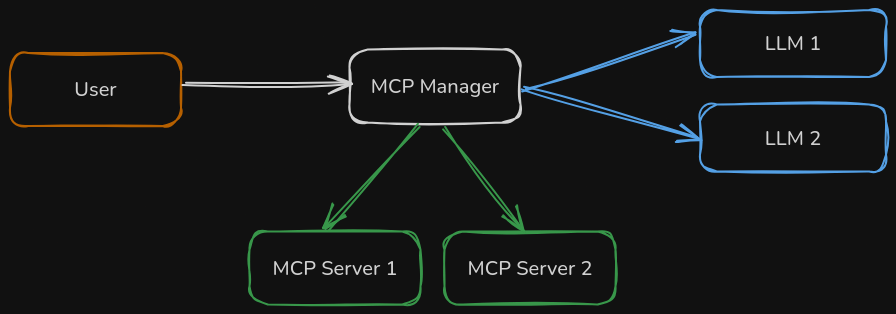

# MCP Manager

<!--[](https://gitlab.com/DMaxter/mcp-manager/-/pipelines?page=1&scope=all&ref=main)-->
[](https://gitlab.com/DMaxter/mcp-manager/-/releases/permalink/latest)

MCP Manager acts as a bridge between Large Language Models (LLMs) and MCP servers. It allows you to interact with remote and local APIs using natural language prompts via supported chat completion APIs.

Workspaces can be defined with distinct configurations, enabling connections to different LLM endpoints and MCP servers (potentially on various ports, addresses, or paths) using a single MCP Manager instance.

### What is an MCP Server?

An MCP server is a middleware that currently sits between LLMs and APIs allowing the LLM to check which tools it has available to perform actions that the user prompt might have and decide to act instead of providing only an answer to the user. An MCP server translates this "will" of the model to perform an action into the action itself, might it be a change or a query to some system.

If you want to learn more, head over to <https://mcp.so> and scroll to the bottom for the FAQ section.


### Why MCP Manager?

Because to the best of my knowledge there is no other tool that is generic enough to be able to integrate MCP servers with most LLM vendors without much effort. It is just a config file and then it can be used just like you would call your model directly.


### Where does MCP Manager sit?




## Features

* Integrates with various LLMs
* Enables LLM interaction with MCP servers
* Flexible workspace configuration via a single YAML file
* Supports models without authentication, with API Key or with OAuth2 Bearer tokens
* Exposes a simple HTTP API for sending prompts, in the OpenAI format
* Control LLM response parameters(`max_tokens`, `temperature`, `top_k`) directly in the request body
* Filter which MCP server's tools should be used or not
* Analysis of all the messages exchanged between MCP Manager and the LLM
* Summary of the total amount of tokens used in all the communications between MCP Manager and the LLM


## Installation

Just download the appropriate file for your operating system in the [Release](https://gitlab.com/DMaxter/mcp-manager/-/releases) section, on **Packages**, and it is ready to go.


## Configuration

The configuration is managed through a YAML file (default: `config.yaml` in the runtime directory). The path can be overriden using the `MCP_MANAGER_CONFIG` environment variable.

An annotated example configuration file is available at [config.example.yaml](./config.example.yaml).

### Authentication

Currently, only API Key authentication is supported and is configured within the model settings. [OAuth 2.0 support](https://gitlab.com/DMaxter/mcp-manager/-/issues/17) is planned.


### LLM Configuration

Configuration varies depending on the LLM provider:
* **Gemini**
    * Requires an [API Key](https://ai.google.dev/gemini-api/docs/api-key)
    * The API endpoint can be found in the [Gemini documentation](https://ai.google.dev/gemini-api/docs/function-calling?example=chart#rest_2)(use the base REST endpoint). The API Key **should be configured via MCP Manager** and **not included in the URL**

* **Azure OpenAI**
    * Requires a self-hosted model on Azure
    * Resource endpoint
    * API Version (see [available versions](https://github.com/Azure/azure-rest-api-specs/tree/main/specification/cognitiveservices/data-plane/AzureOpenAI/inference))
    * Model name
    * API Key

* **OpenAI**
    * Can use self-hosted models or generally available ones
    * Model name
    * Auhentication depends on deployment (commonly API Key)

* **Anthropic**
    * Requires an [API Key](https://console.anthropic.com/settings/keys)
    * Model name
    * The API endpoint is avaialble in the [Anthropic documentation](https://docs.anthropic.com/en/api/overview#examples)


## Usage

1. Start the server

```bash
mcp-manager
```

Optionally with a different configuration path
```bash
export MCP_MANAGER_CONFIG=/path/to/your/config.yaml
mcp-manager
```

2. Perform prompts via HTTP call (assuming default port)

Example with curl, using the workspace configured for `/gemini` and using the filesystem MCP server:
```bash
curl http://localhost:7000/gemini -H "Content-Type: application/json" -d '{"messages": [{"role":"user","content":"Check if the file /tmp/abc exists"}],"temperature":0}'
```

The output is something similar to:
```json
{
  "messages": [
    {
      "role": "user",
      "content": "Check if the file /tmp/abc exists"
    },
    {
      "role": "assistant",
      "tool_calls": [
        {
          "name": "get_file_info",
          "id": "LoNc9rghWZV3pI7OHjeYNc4w",
          "arguments": {
            "path": "/tmp/abc"
          }
        }
      ]
    },
    {
      "type": "FunctionCallOutput",
      "call_id": "LoNc9rghWZV3pI7OHjeYNc4w",
      "output": "Error: ENOENT: no such file or directory, stat '/tmp/abc'"
    },
    {
      "role": "assistant",
      "content": "The file /tmp/abc does not exist."
    }
  ],
  "temperature": 0.0,
  "usage": {
    "completion_tokens": 20,
    "prompt_tokens": 1451,
    "total_tokens": 1471
  }
}
```

We get a complete list of all the messages exchanged between the user, the model, MCP Manager and the MCP servers.


## Limitations

* **Supported LLMs**
    * Gemini
    * Azure OpenAI
    * OpenAI-compatible (OpenAI, Ollama, DeepSeek, ...)
    * Anthropic

* **Supported MCP Server connections**
    * Local MCP servers
    * (Planned: [Remote MCP servers](https://gitlab.com/DMaxter/mcp-manager/-/issues/5))


## Troubleshooting

If you are experiencing some errors, feel free to [open an issue](https://gitlab.com/DMaxter/mcp-manager/-/issues) and paste the log output (with redacted information as needed) with the log level set to `debug`. To achieve this, set the environment variable `RUST_LOG` to `debug` and run MCP Manager again to have the complete logs.

If you think you are able to fix your problem, feel free to fork this repo, apply the fix and open a merge request. You can find all the needed information in the [Contributing](#contributing) section.


## Contributing

Contributions are welcome, see [CONTRIBUTING.md](./CONTRIBUTING.md)

Main development occurs on [GitLab](https://gitlab.com/DMaxter/mcp-manager). Issues and merge requests should be submitted there. A mirror repository is maintained on [GitHub](https://github.com/DMaxter/mcp-manager) and issues opened on GitHub will be manually migrated to GitLab.

Bug reports and feature requests are encouraged via [GitLab Issues](https://gitlab.com/DMaxter/mcp-manager/-/issues).

## License

This project is licensed under GNU GPLv3
